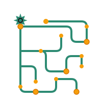

<div align="center">



# Cascade

**Wire AI models together on a canvas. Press run.**

Drag nodes, connect them, and Cascade figures out what can run in parallel —
generating images, video, and speech through one graph.

**[Live app](https://cascade-ys7.vercel.app)**

<br />


</div>

---

## What it does

You build a directed graph. Each node is a model call or a media operation, and
each edge carries a typed asset — text, image, video, audio — from one node's
output into the next node's input.

```
   ┌──────────────┐      ┌──────────────┐      ┌──────────────┐
   │  OpenRouter  │─────▶│   Seedream   │─────▶│   Seedance   │
   │  write scene │ text │  still frame │ image│  animate it  │
   └──────────────┘      └──────────────┘      └──────┬───────┘
                                                       │ video
   ┌──────────────┐      ┌──────────────┐              │
   │  ElevenLabs  │─────▶│   Lipsync    │◀─────────────┘
   │   narration  │ audio│   sync them  │
   └──────────────┘      └──────┬───────┘
                                │ video
                                ▼
                         finished clip
```

The executor walks the graph, starts every node whose inputs are ready, and
keeps going as results land — so the two branches above run at the same time
rather than one after the other.

---

## Features

**Canvas**
Drag-and-drop editing on ReactFlow, with type-checked connections that refuse
to link an audio output into an image input. Auto-layout untangles a messy
graph into a readable DAG. Undo/redo, multi-select, and version history with
one-click restore.

**Execution**
True DAG scheduling — nodes wait only on their own dependencies, never on a
batch. Progress streams back live over Trigger.dev Realtime. A failed node
propagates failure downstream instead of leaving the run half-finished.

**Cost control**
Every node carries a credit estimate, totalled before you commit to a run.
Toggle *skip* on a node to reuse its last output and spend nothing re-running
a step you have already paid for.

**Extending it**
Nodes are declarative. A new node is an entry in `lib/config/nodes/` — fields,
handles, and provider binding — and the generic renderer builds the component,
the form, and the validation from it. No new React component required.

---

## Nodes

| Node | Provider | What it does |
|------|----------|--------------|
| **Seedream 4.5** | fal.ai | Text-to-image with strong prompt adherence |
| **SeedVR 2** | fal.ai | Image upscaling with face enhancement |
| **Seedance 1.5** | fal.ai | Cinematic video from a prompt, or animate a still |
| **Sync Lipsync** | fal.ai | Match mouth movement to an audio track |
| **OpenRouter LLM** | OpenRouter | GPT, Claude, Gemini and others behind one API |
| **ElevenLabs V3** | ElevenLabs | Text-to-speech with emotion control |
| **Crop Image** | Internal | Percentage-based cropping |
| **Merge Videos** | Internal | Concatenate clips, optional transitions |
| **Merge Audio + Video** | Internal | Combine or replace a video's audio track |
| **Extract Audio** | Internal | Pull the audio track out of a video |
| **Image / Video / Audio Input** | — | Upload entry points for your own media |

---

## Quick start

**You'll need** Node 18+, a PostgreSQL database ([Neon](https://neon.tech) works
well), and accounts for [Clerk](https://clerk.com) and
[Trigger.dev](https://trigger.dev).

```bash
git clone https://github.com/yashsrivasta7a/Flowsmith.git cascade
cd cascade
npm install

cp .env.example .env.local     # fill in the values below

npm run db:generate
npm run db:push
```

Then start both processes — the app and the background worker:

```bash
npm run dev          # terminal 1 → http://localhost:3000
npm run trigger:dev  # terminal 2 → executes the nodes
```

> Without the Trigger.dev worker running, workflows queue but never execute.

---

## Environment

```env
# Database
DATABASE_URL="postgresql://..."

# Auth
NEXT_PUBLIC_CLERK_PUBLISHABLE_KEY="pk_..."
CLERK_SECRET_KEY="sk_..."

# Background jobs
TRIGGER_SECRET_KEY="tr_dev_..."
TRIGGER_PROJECT_REF="proj_..."

# Model providers
FAL_KEY="..."
OPENROUTER_API_KEY="..."
ELEVENLABS_API_KEY="..."

# Media CDN
TRANSLOADIT_AUTH_KEY="..."
TRANSLOADIT_AUTH_SECRET="..."

NEXT_PUBLIC_APP_URL="http://localhost:3000"
```

---

## Architecture

```
Browser ── tRPC ──▶ Next.js ── Prisma ──▶ PostgreSQL
   ▲                   │
   │                   └── triggers ──▶ Trigger.dev workers
   │                                          │
   └──────── Realtime run updates ────────────┤
                                              ├──▶ fal.ai
                                              ├──▶ OpenRouter
                                              ├──▶ ElevenLabs
                                              └──▶ Transloadit (CDN)
```

Long media jobs run on Trigger.dev rather than in a serverless request, so
FFmpeg work and slow model calls aren't bound by a request timeout. The browser
subscribes to run updates directly, which keeps progress live without polling.

**Where things live**

| Path | Purpose |
|------|---------|
| `components/flow/flow-canvas.tsx` | The editor canvas |
| `components/flow/generic-node.tsx` | One component renders every node type |
| `lib/config/nodes/` | Declarative node definitions |
| `app/trigger/workflow-executor.ts` | DAG scheduler |
| `app/trigger/node-executor.ts` | Runs a single node |
| `store/flow-store.ts` | Canvas state (Zustand) |

---

## Shortcuts

| Key | Action | | Key | Action |
|-----|--------|-|-----|--------|
| `R` | Run workflow | | `Ctrl/⌘ + Z` | Undo |
| `N` | Node palette | | `Ctrl/⌘ + ⇧ + Z` | Redo |
| `H` | Timeline | | `Ctrl/⌘ + C` | Copy |
| `A` | Assets | | `Ctrl/⌘ + V` | Paste |
| `C` | Credits | | `Ctrl/⌘ + S` | Save |
| `G` | Auto-arrange | | `Delete` | Delete selection |
| `S` | Shortcuts | | `Esc` | Cancel / stop run |

---

## Scripts

```bash
npm run dev          # dev server
npm run trigger:dev  # background worker
npm run build        # production build
npm run typecheck    # tsc --noEmit
npm run lint         # eslint
npm run db:studio    # browse the database
```

---

## API

Cascade exposes a typed tRPC API, mirrored to REST via `trpc-to-openapi`.
Workflows can be created and executed programmatically — the same engine the
canvas uses.

```
GET /api/openapi     # OpenAPI spec, importable into Postman or Insomnia
```

Authenticate with a Bearer token from **Settings → API Keys**:

```bash
curl -H "Authorization: Bearer sk_live_..." \
  https://cascade-ys7.vercel.app/api/v1/credits/balance
```

---

## MCP server

Cascade ships an [MCP](https://modelcontextprotocol.io) server, so Claude,
Cursor, and other LLM clients can build, run, and inspect workflows in
conversation — through the same API the canvas uses.

**32 tools**, covering workflow CRUD, execution and monitoring, credits, node
introspection, presets, and one-shot helpers (`quick_llm`, `quick_image`,
`quick_vision`).

### Install

Not on npm yet, so build it from source:

```bash
cd mcp/cascade
npm install
npm run build
```

### Connect a client

Add this to your client's MCP config — `claude_desktop_config.json` for Claude
Desktop (`%APPDATA%\Claude\` on Windows, `~/Library/Application Support/Claude/`
on macOS), or the MCP settings in Cursor:

```json
{
  "mcpServers": {
    "cascade": {
      "command": "node",
      "args": ["/absolute/path/to/cascade/mcp/cascade/dist/index.js"],
      "env": {
        "CASCADE_API_KEY": "sk_live_..."
      }
    }
  }
}
```

The path must be absolute, and it points at `dist/`, not `src/` — the client
runs the compiled output. Restart the client after editing the config.

| Variable | Required | Default |
|----------|----------|---------|
| `CASCADE_API_KEY` | yes | — (get one from Settings → API Keys) |
| `CASCADE_API_URL` | no | `https://cascade-ys7.vercel.app` |

Point `CASCADE_API_URL` at `http://localhost:3000` to drive a local instance.

### Verify it works

Without a client, you can speak the protocol directly:

```bash
cd mcp/cascade
printf '%s\n%s\n%s\n' \
  '{"jsonrpc":"2.0","id":1,"method":"initialize","params":{"protocolVersion":"2024-11-05","capabilities":{},"clientInfo":{"name":"probe","version":"1"}}}' \
  '{"jsonrpc":"2.0","method":"notifications/initialized"}' \
  '{"jsonrpc":"2.0","id":2,"method":"tools/list","params":{}}' \
  | CASCADE_API_KEY=sk_live_... node dist/index.js
```

A healthy server logs `Server configured with 32 tools` to stderr and returns
the tool list on stdout. Then ask your client something like *"list my Cascade
workflows"* or *"build me a workflow that crops an image"*.

---

<div align="center">
<sub>Private project · All rights reserved</sub>
</div>
